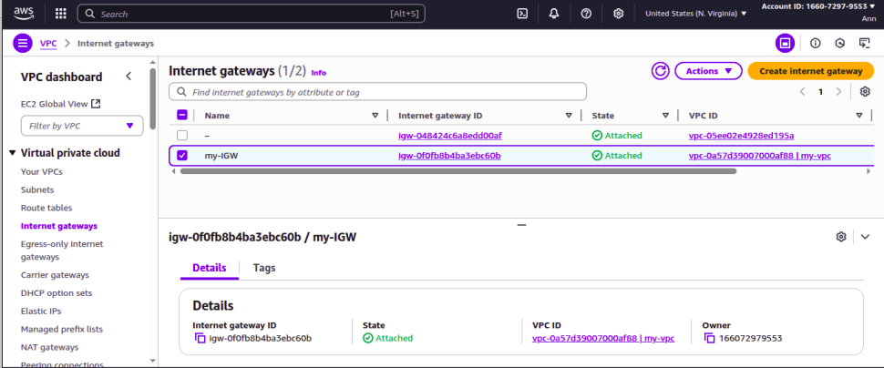
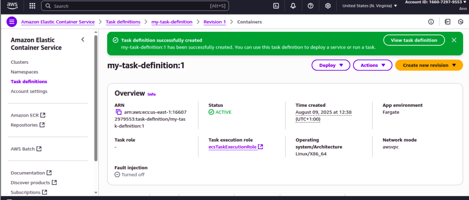
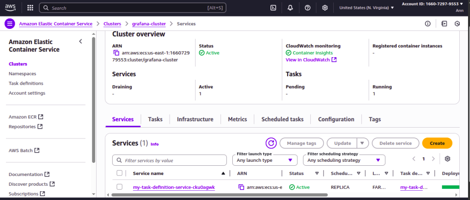
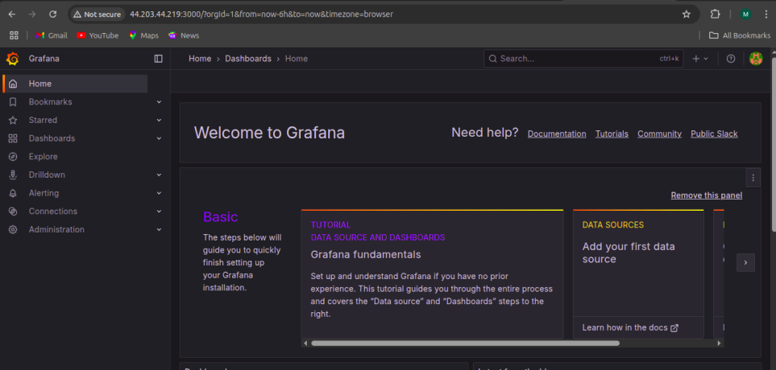
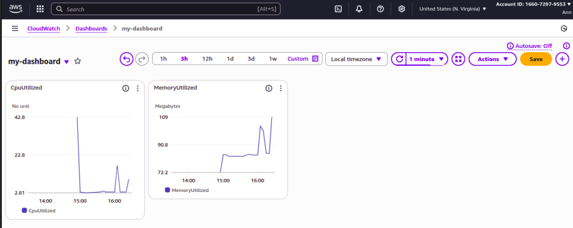
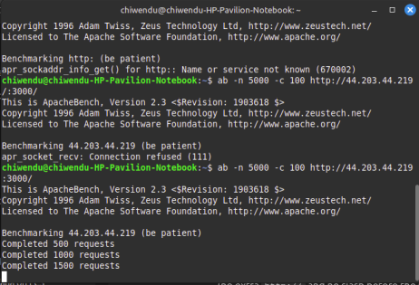
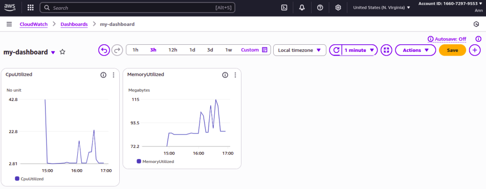

### Deploying Grafana on Amazon ECS with Fargate and Monitoring with CloudWatch 
---

### Objective
The goal of this project was to deploy a containerized Grafana application on Amazon ECS with Fargate, using appropriate CPU and memory settings. Once deployed in a public subnet, a CloudWatch dashboard was created with widgets for CPU and memory utilization to monitor the ECS task in real time. To gain deeper insights, application load was simulated to observe metric fluctuations.

### Skills Learned
- Provisioning ECS tasks with CPU and memory configuration.
- Deploying applications using Amazon ECS with Fargate.
- Configuring public subnet networking for external access.
- Creating Amazon CloudWatch dashboards with monitoring widgets.
- Performing load simulation and stress testing with Apache Bench.
- Observing real-time scaling and performance metrics of ECS tasks.

### Tools Used
- Amazon ECS (Fargate) → For containerized application deployment.
- Grafana (Docker Image) → Monitoring and visualization tool deployed as container.
- Amazon CloudWatch → For creating dashboards and monitoring resource utilization.
- AWS VPC, Subnets, Route Tables, and IGW → Networking setup for public access.
- Apache Bench (ab) → For stress testing and generating application load.
- Web Browser (Chrome) → To access Grafana UI.

### Environment Setup
- Cloud Provider: AWS
- ECS Launch Type: Fargate
- Container Image: grafana/grafana
- Networking: Public Subnet with Auto-assign IPv4 and Internet Gateway
- Ports: 3000 (Grafana UI)
- Monitoring: CloudWatch Dashboards (CPU & Memory Utilization)

### Steps
1. I created a VPC with a public subnet, enabled auto-assign IPv4 addresses, configured route tables and attached an Internet Gateway for external access.

 

2. I created a task definition for Grafana. I Assigned CPU and memory values suitable for Fargate deployment and exposed port 3000 for web access.

 

3. I created an ECS cluster using Fargate and deployed a service to run the Grafana container.

 

4. I accessed Grafana in a web browser via the ECS task’s public IP on port 3000.

 

5. I created a CloudWatch dashboard, added widgets for CPU utilization and memory utilization of ECS tasks.

 

6. Since ECS Fargate containers are managed by AWS, and I don't have direct shell access by default, i installed apache bench and ran ab -n 5000 -c 100 http://44.203.44.219:3000/ on my host 

 

7. After stress testing the app for 30 minutes, I observed CloudWatch metrics change

  

 ### Conclusion
 I successfully deployed Grafana on Amazon ECS using Fargate and set up a CloudWatch dashboard for real-time monitoring of CPU and memory utilization. Load testing with Apache Bench confirmed the dashboard’s effectiveness in reflecting usage spikes, providing deeper visibility into container performance.

