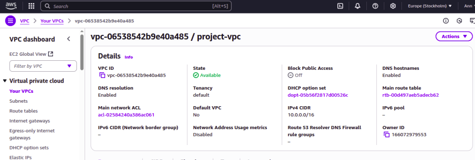
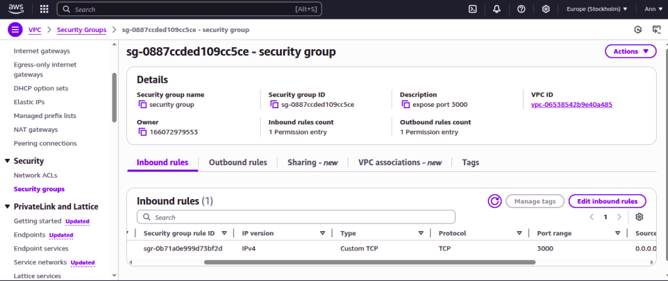
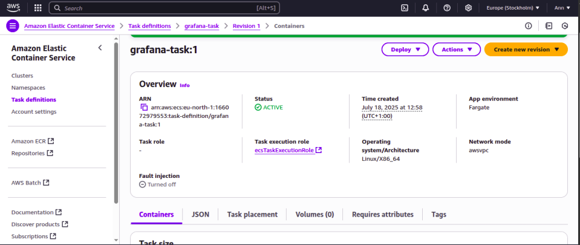
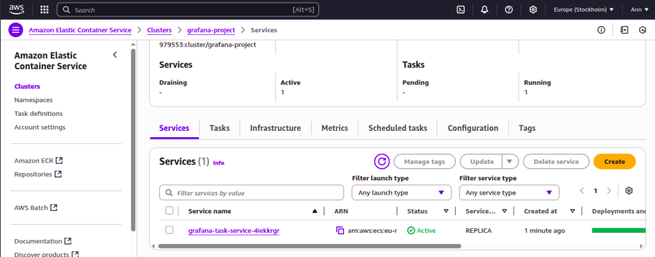
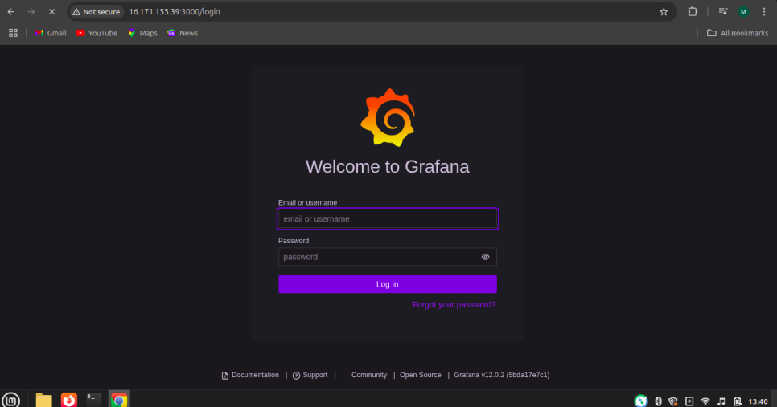
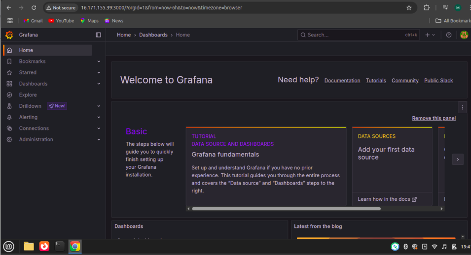

### Deploying Grafana on Amazon ECS with Fargate
---

### Objective
The goal of this project was to deploy Grafana using Amazon ECS with Fargate, leveraging the official Docker image grafana/grafana. The task involved creating a Fargate task definition, exposing port 3000, deploying the service in a public subnet, and ensuring inbound traffic access on port 3000 through security group rules.

### Skills Learned
- Deploying containerized applications using Amazon ECS with Fargate.
- Creating and configuring task definitions for containerized workloads.
- Configuring security groups to allow specific inbound traffic.
- Managing ECS clusters and services.
- Accessing deployed applications via browser using public IP and exposed ports.

### Tools Used
- Amazon ECS (Fargate): To deploy and manage the containerized Grafana application.
- Docker Hub: Source of the official Grafana image.
- AWS IAM: To create roles for ECS tasks to pull container images.
- AWS VPC & Subnets: Networking environment for the ECS tasks.
- AWS Security Groups: To restrict and allow inbound/outbound network traffic.
- Web Browser (Chrome): To access the Grafana web interface.

### Environment Setup
- Cloud Provider: Amazon Web Services (AWS)
- ECS Launch Type: Fargate
- Container Image: grafana/grafana
- Port: 3000 (default Grafana port)
- Access: Browser access using ECS task public IP

### Steps
1. I created a VPC with 2 Public Subnets to set up the networking environment to host the ECS tasks.

    

2. I created a Security Group to allow traffic on Port 3000 (Grafana’s default web UI port).

    

3. I created an IAM Role with permissions allowing ECS tasks to pull images from Docker Hub. I also created a Task Definition named grafana-task using the grafana/grafana image and exposing port 3000.

     

4. I Created an ECS Cluster and deployed a Service that ensures the Grafana container remains running. I also verified the service launched successfully in the public subnet.

     

5. I accessed Grafana through my chrome Browser using the public ip and default port 3000

     

6. I successfully logged into grafana using the default admin admin credentials

     

### Conclusion
This project successfully demonstrated deploying Grafana on Amazon ECS with Fargate. I was able to:
- Create the required VPC, subnets, and security group.
- Configure an ECS task definition with the official Grafana Docker image.
- Deploy and manage Grafana using an ECS Cluster and Service.
- Access the application securely through my browser on port 3000.
