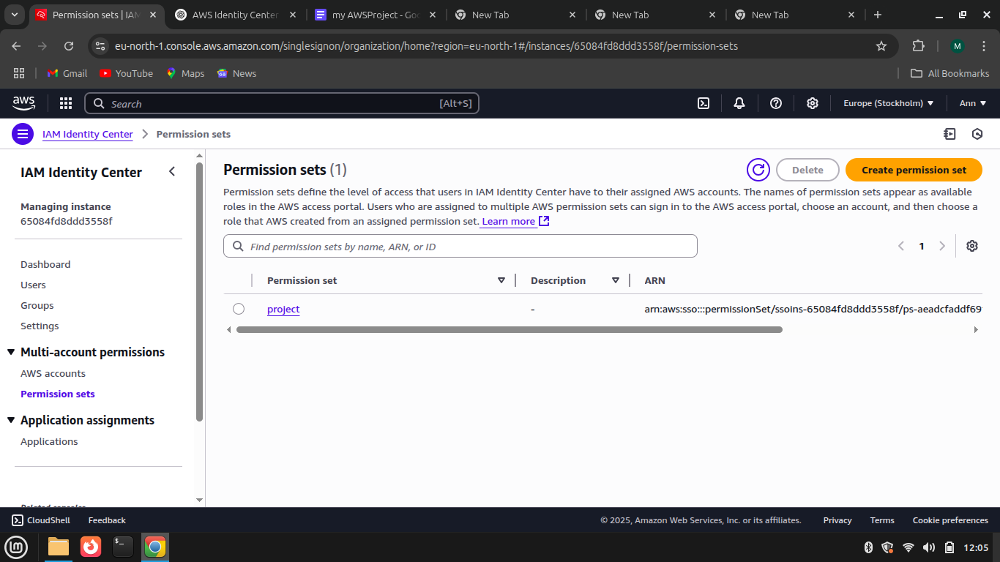
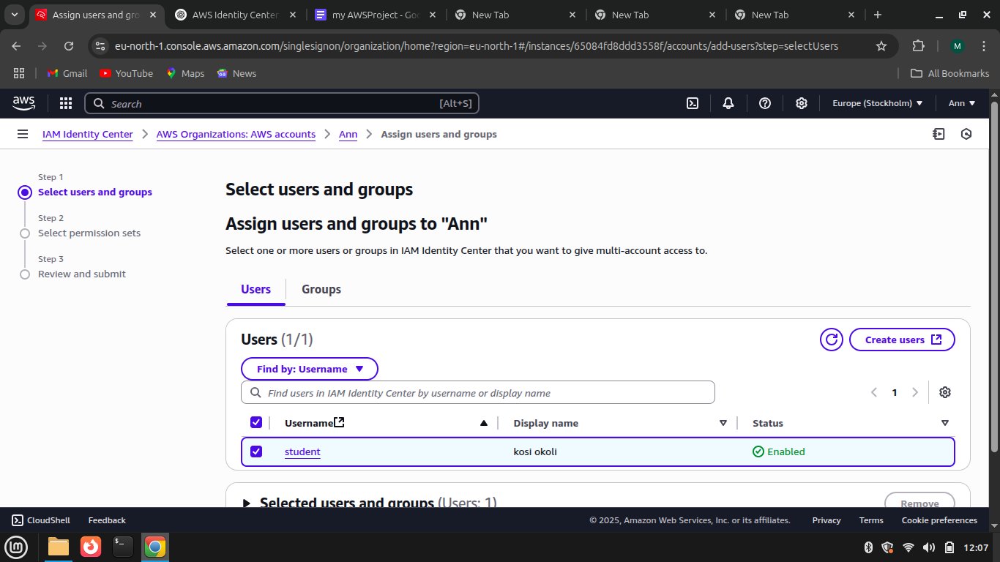
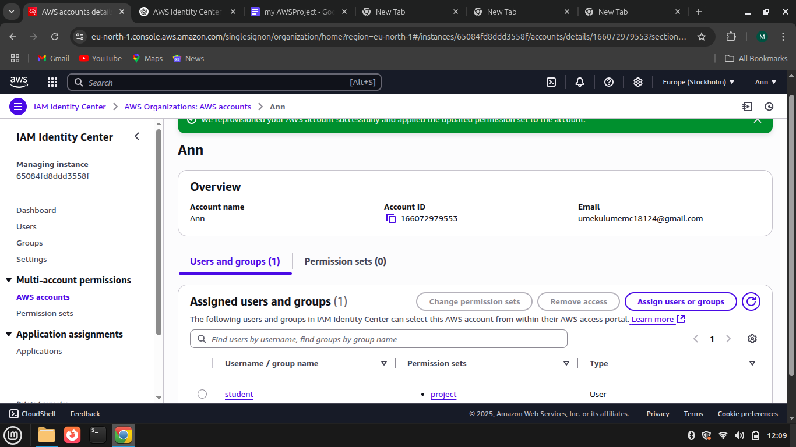

# AWS Identity Center with Security Audit Permission Set

## Objective
Configure AWS Identity Center, create a user, and assign the predefined **SecurityAudit** permission set.

## Steps I followed
1. Opened **IAM Identity Center** and enabled it for my account.
2. Created a test user and assigned the **SecurityAudit** permission set.
3. Tested sign-in to confirm access worked as expected.

## Screenshots

## Outcome
User can sign in via Identity Center with read-only security audit visibility.
