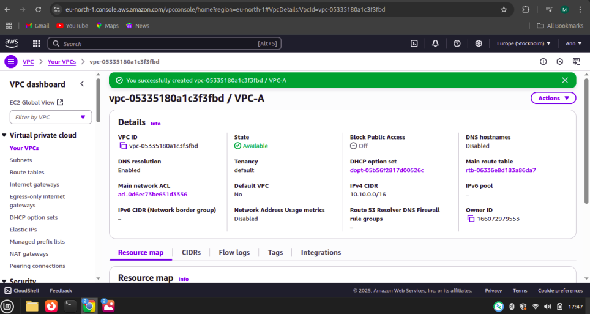
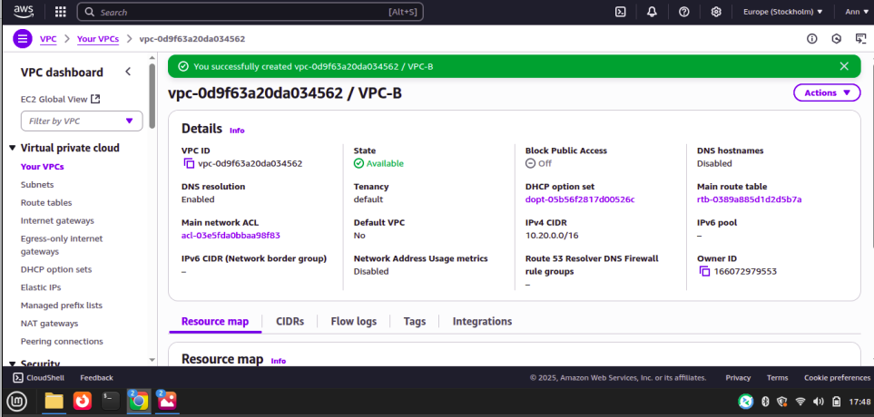
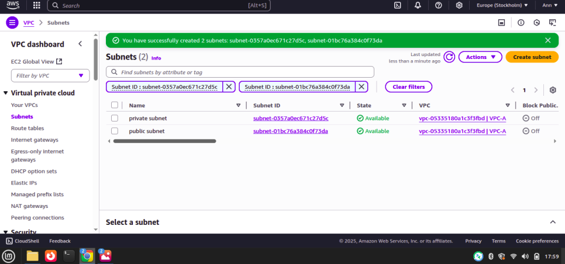
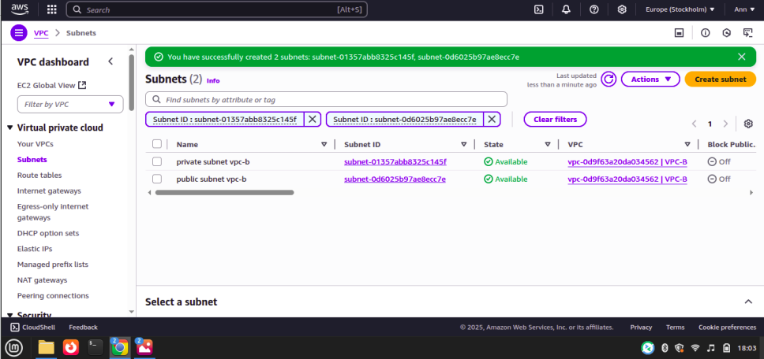
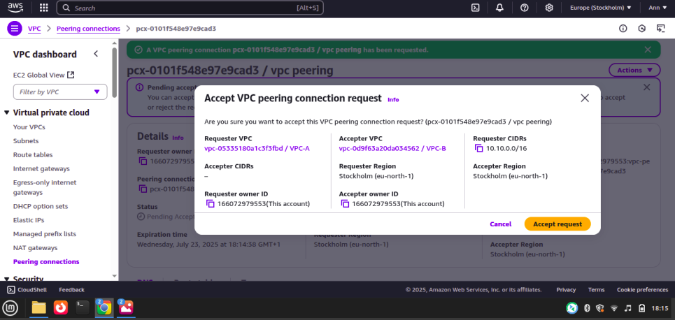
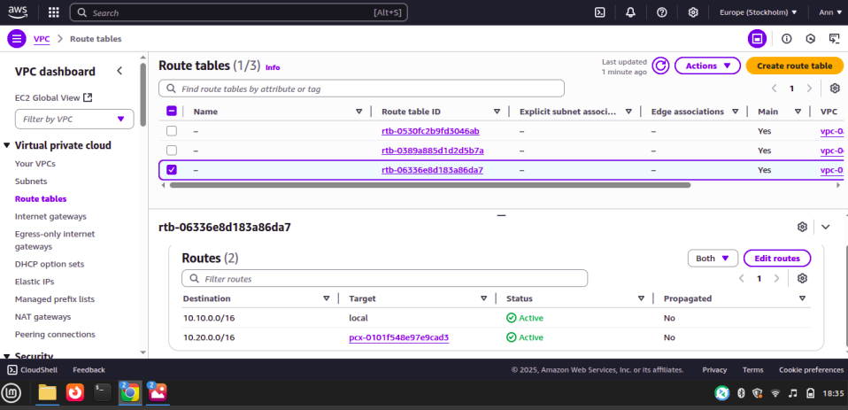
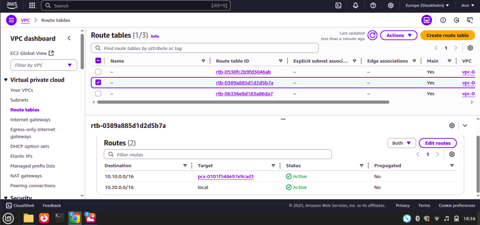

### Building a Multi-VPC Architecture with VPC Peering on AWS

### Objective
The goal of this project was to design and deploy a multi-VPC architecture on Amazon Web Services (AWS). I created two separate VPCs, configured subnets in each, and established a VPC peering connection to enable communication between them. This project demonstrates how to interconnect multiple networks securely in the cloud.

### Skills Learned
- Creating and managing Virtual Private Clouds (VPCs) in AWS.
- Configuring subnets (public and private) for network segmentation.
- Setting up VPC peering connections between isolated VPCs.
- Updating route tables to enable cross-VPC communication.
- Understanding multi-VPC design patterns and network routing in AWS.

### Tools Used
- Amazon VPC: To create isolated virtual networks.
- AWS Subnets: To organize resources into public and private zones.
- VPC Peering: To enable connectivity between two VPCs.
- AWS Management Console: For setup and configuration.

### Environment Setup
- Cloud Provider: Amazon Web Services (AWS)
- VPC-A CIDR Block: 10.10.0.0/16
- VPC-B CIDR Block: 10.20.0.0/16
- Subnets: Each VPC has one public and one private subnet
- Connectivity: VPC peering connection between VPC-A and VPC-B

### Steps
1.  I created VPC-A with CIDR block 10.10.0.0/16.

     
    
2. I created VPC-B with CIDR block 10.20.0.0/16.

     
   
3. I created 1 public subnet and 1 private subnet in VPC-A.

     

4. I created 1 public subnet and 1 private subnet in VPC-B.

     

5. I created a VPC peering connection between VPC-A and VPC-B, then accepted the peering request.

     

6. I edited the route table for VPC-A to add a route pointing to VPC-B’s CIDR block (10.20.0.0/16) through the peering connection.

    

7. I edited the route table for VPC-B to add a route pointing to VPC-A’s CIDR block (10.10.0.0/16) through the peering connection.

      

### Conclusion
This project successfully demonstrated the setup of a multi-VPC architecture in AWS. I was able to:
- Create and configure two VPCs with subnets.
- Establish a secure peering connection between them.
- Update route tables to enable cross-VPC communication.
