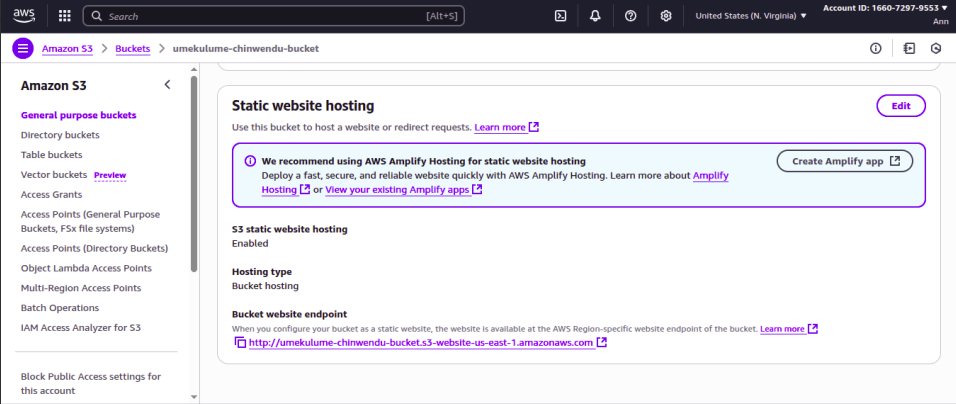

### Deploying a Personal Static Website Using Amazon S3 and CloudFront
---

### Objective
The objective of this project was to deploy a resume page using Amazon S3 for hosting and Amazon CloudFront for secure global content delivery. The website includes my resume and photo, making it accessible to the public via a CloudFront distribution.

### Skills Learned
- Hosting static websites on Amazon S3.
- Configuring S3 bucket policies for secure public access.
- Setting up CloudFront distributions for content delivery.
- Managing and uploading website assets (HTML, CSS, images).
- Understanding secure access and global delivery optimization with CloudFront.

### Tools Used
- Amazon S3 → For static website hosting.
- Amazon CloudFront → For secure, global content distribution.
- JSON Bucket Policy → To configure public access to hosted files.
- Web Browser → To test and validate hosted website.

### Environment Setup
- Cloud Provider: AWS
- Website Files: HTML (resume), image file
- Origin: S3 bucket
- Delivery: CloudFront Distribution
- Access: Public via CloudFront domain name

### Steps
Step 1: I created an S3 bucket dedicated to hosting the static site and i enabled Static Website Hosting in bucket properties.

  

Step 2: I created a bucket policy in JSON format and allowed public access so that users can view the website files.

  

Step 3: I Uploaded my resume HTML file and image file (photo) into the bucket.

  

Step 4: I accessed the static website endpoint directly from the S3 bucket and verified that the website displayed correctly with my resume and photo.

  

Step 5: I created a CloudFront distribution with the S3 bucket as its origin. I configured distribution settings to deliver content securely.

  

Step 6: I accessed the static website through the CloudFront URL and verified that the website loaded securely and quickly.

  

 ### Conclusion
 I successfully deployed a personal static website (resume page) using Amazon S3 and delivered it securely through Amazon CloudFront. The project demonstrated my ability to configure static hosting, bucket policies, and CDN integration, ensuring both accessibility and optimized global delivery.

