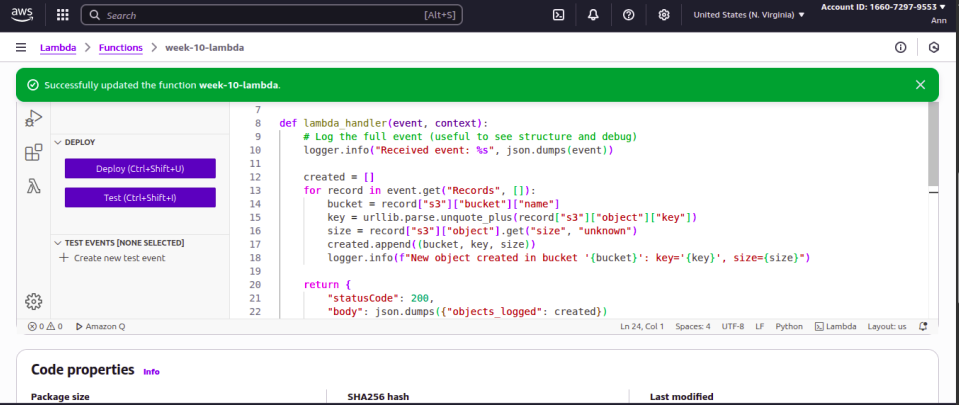
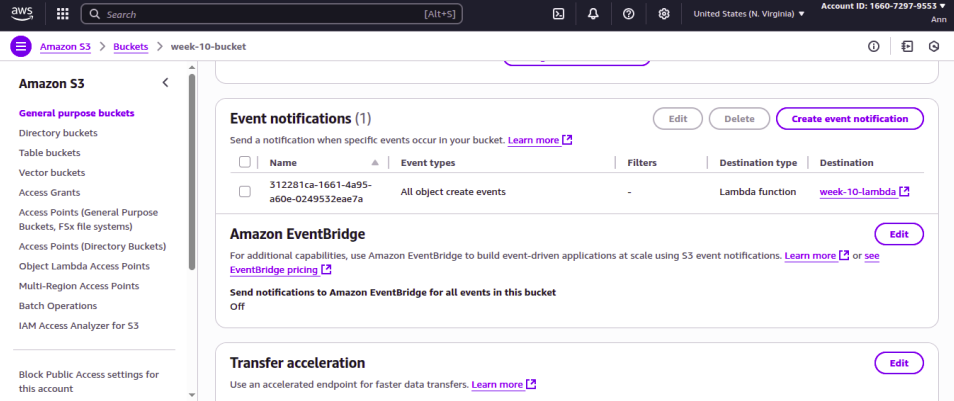
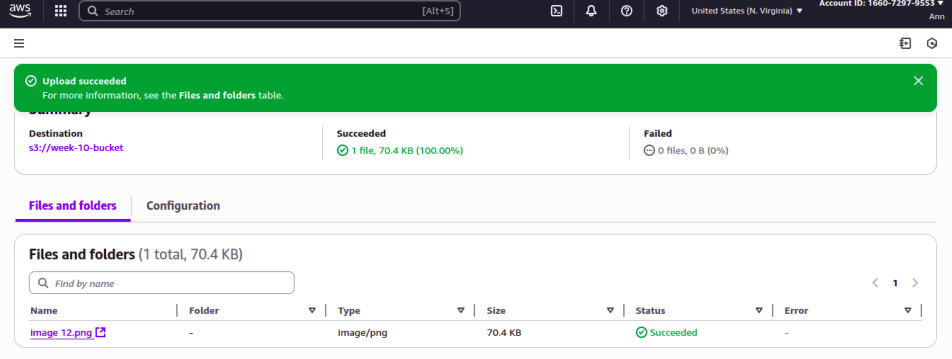
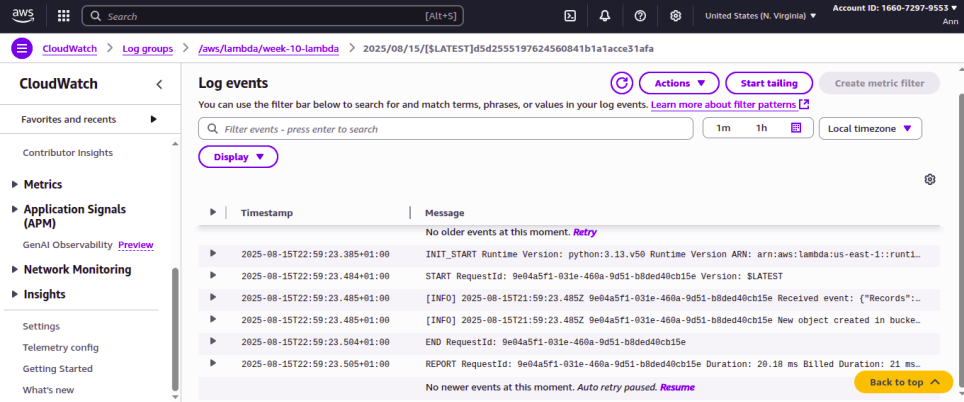

### Automating File Upload Triggers with Amazon S3 and AWS Lambda
---

### Objective
The objective of this project was to automatically trigger a Lambda function whenever a new file is uploaded to an S3 bucket. The Lambda function was designed to log the name of the uploaded file, confirming the upload and demonstrating event-driven automation in AWS.

### Skills Learned
- Creating and configuring Amazon S3 buckets.
- Writing and deploying AWS Lambda functions in Python.
- Configuring S3 Event Notifications to trigger Lambda.
- Monitoring execution results through Amazon CloudWatch Logs.
- Understanding event-driven serverless architecture in AWS.

### Tools Used
- Amazon S3 → Storage and event source.
- AWS Lambda → Serverless compute for event handling.
- Python → For writing the Lambda function.
- Amazon CloudWatch Logs → For monitoring and validating Lambda execution.

### Environment Setup
- Cloud Provider: AWS
- Trigger: S3 ObjectCreated event
- Runtime: Python 3.x Lambda function
- Logging: CloudWatch Logs

### Steps
Step 1: I created an S3 bucket to store uploaded files.

 

Step 2: I Wrote and deployed a Python Lambda function that logs the name of the uploaded file.

 

Step 3: I Set up event notifications in S3 to trigger the Lambda function whenever an ObjectCreated event occurs.

 

Step 4: I Uploaded a test file to the S3 bucket to trigger the workflow.

 

Step 5: I validated my settings with CloudWatch Logs

 

### Conclusion 
I successfully configured an event-driven architecture where an S3 bucket automatically triggers a Lambda function upon file upload. The Lambda function captured and logged the uploaded file name, and the execution was validated through CloudWatch Logs. This project demonstrated how to use AWS serverless services to automate workflows.
