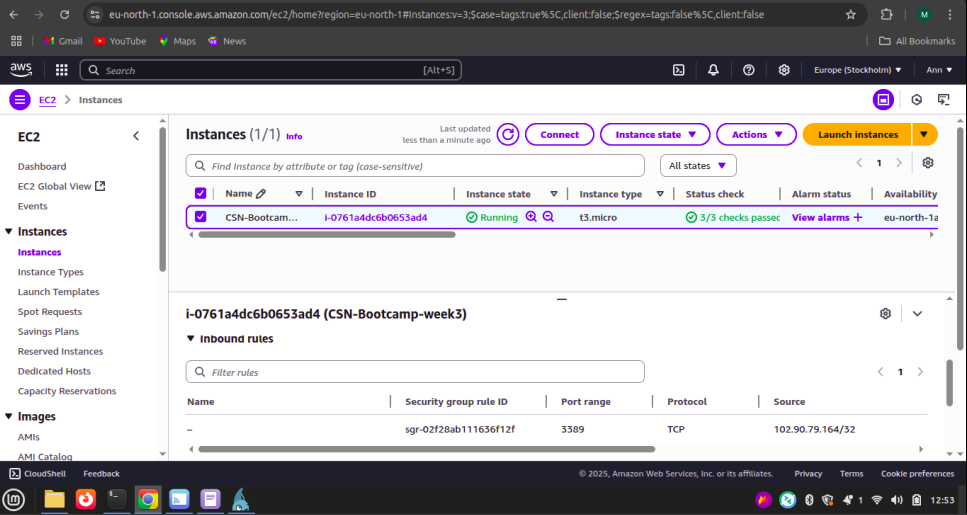
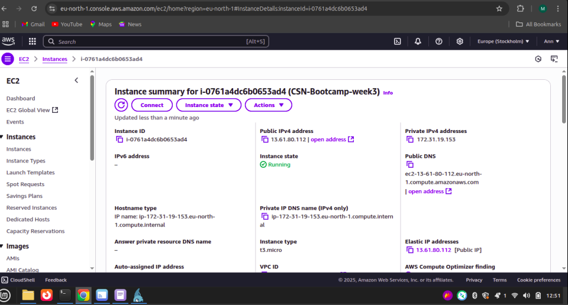
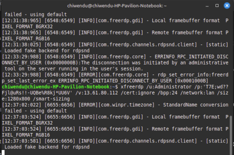
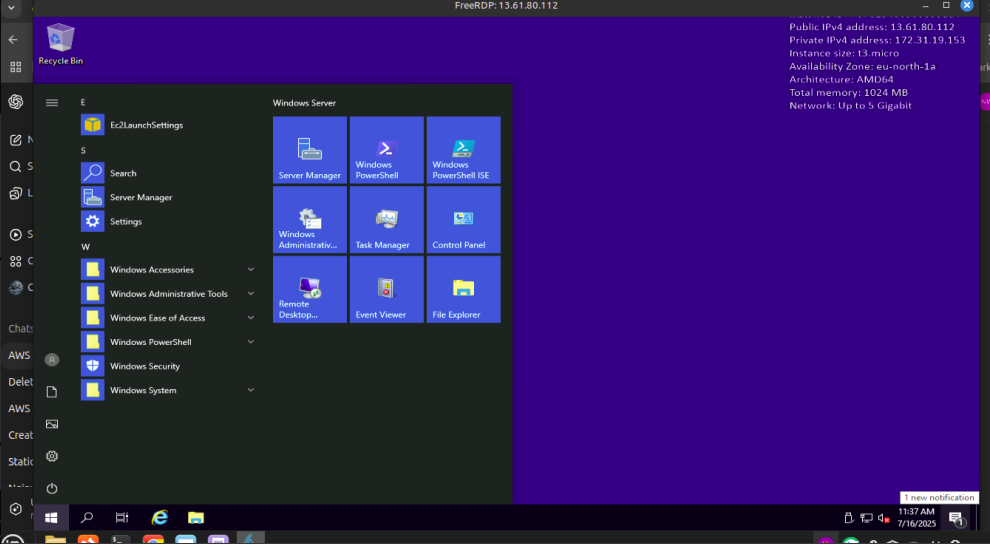
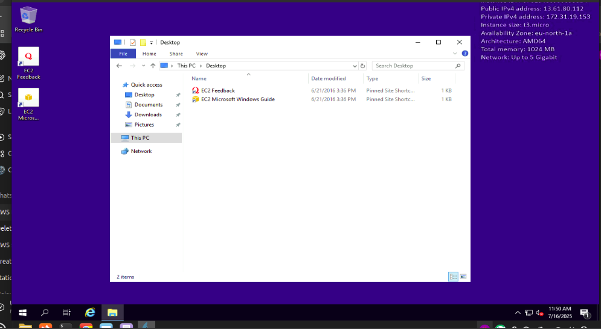

# Deploying a Windows Server EC2 Instance on AWS

## Objective
The goal of this project was to deploy a Windows Server 2019 EC2 instance on Amazon Web Services (AWS), secure it using a security group that allows RDP access (port 3389) only from my public IP address, and successfully establish a remote connection to the instance.

### Skills Learned
- Provisioning and managing EC2 instances on AWS.
- Configuring security groups to restrict access using IP-based rules.
- Establishing secure remote desktop connections to Windows instances.
- Using xfreerdp on Linux to connect to Windows servers via RDP.
- Understanding basic cloud security best practices.

### Tools Used
- Amazon EC2: To provision the Windows Server virtual machine.
- AWS Security Groups: To enforce network access controls.
- xfreerdp: Open-source RDP client used to connect from Linux.
- AWS Management Console: For instance configuration and monitoring.

### Environment Setup
Cloud Provider: Amazon Web Services (AWS)
OS on EC2: Windows Server 2019 Base
Local System: Linux (Ubuntu-based)
Connectivity: RDP (Port 3389) restricted to my public IP

### Steps
1. Launched the EC2 Instance

  

2. I Created a new security group, Allowed RDP access (port 3389) only from my public IP address for secure access and denied all other external traffic.

  

3. I connected to the Instance (From Linux). Since I’m using a Linux system, I used xfreerdp to establish a Remote Desktop connection using the command xfreerdp /u:Administrator /p:'T7E;wd??Fjl@uRs!!-UQBe%R8kj*UU6V' /v:13.61.80.112 /cert:ignore /bpp:24 /network:lan /size:1280x800 /smart-sizing

  

4. I Successfully connected via rdp

   

   

 ### Conclusion
This project successfully demonstrated the deployment and secure configuration of a Windows Server EC2 instance on AWS. I was able to:
- Launch and configure a Windows instance.
- Secure it by restricting RDP access to only my IP.
- Connect from Linux using xfreerdp.

